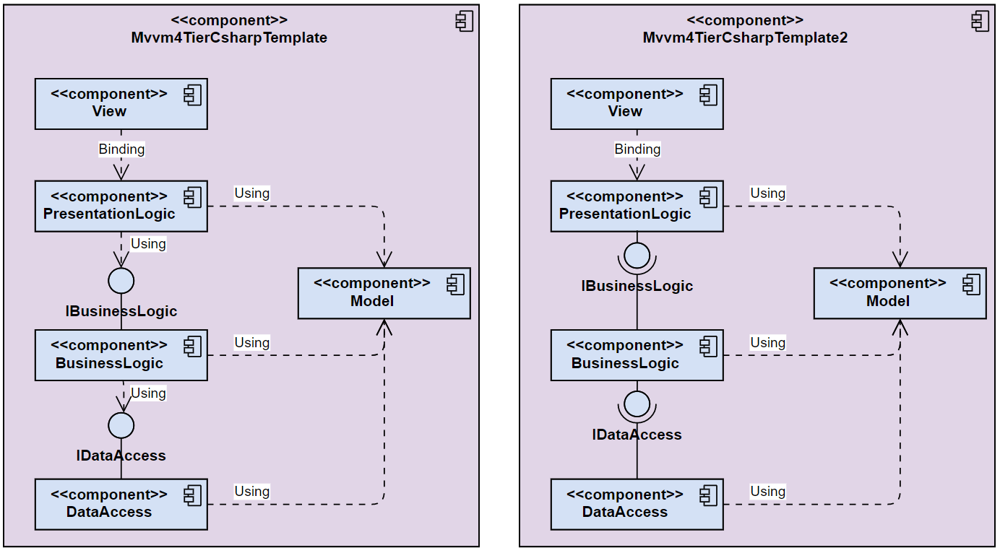

## Project description 

Architecture template for components. The purpose is the fast and easy creation of software components with a standard architecture.

## Architecture

The architecture combines a classical layer architecture with the MVVM pattern.  
 

  

## Technology stack

* C# (.Net Core)
* Visual Studio Community 2019
* NUnit
* NSubstitute
