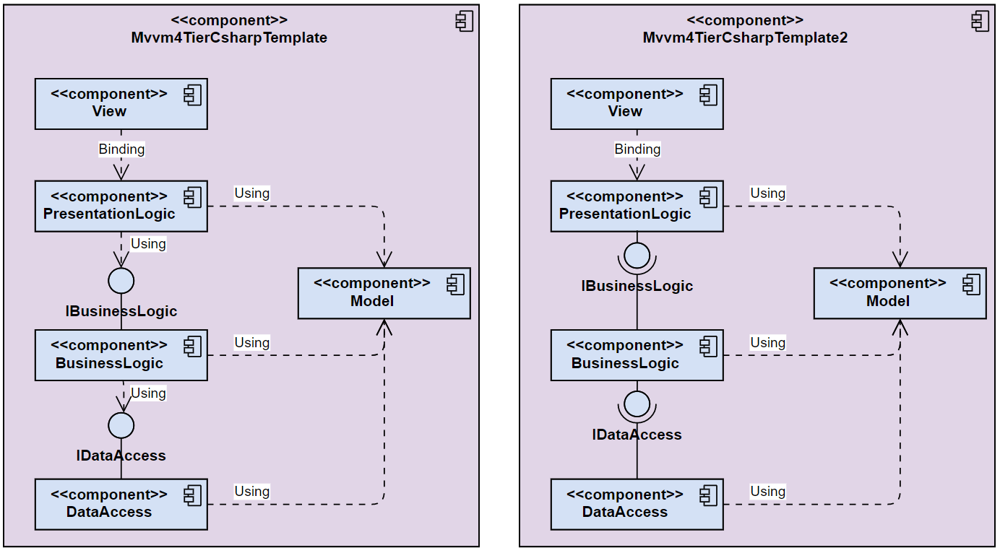

## Project description
Template for WPF applications with mvvm pattern and 4 tier architecture. 

## Architecture

The architecture combines a classical layer architecture with the MVVM pattern.  
FoBOFD itself does not require a data layer and business layer.  
The subcomponent ExplorerTreeView also combines a classical layer architecture with the MVVM pattern.  

  
